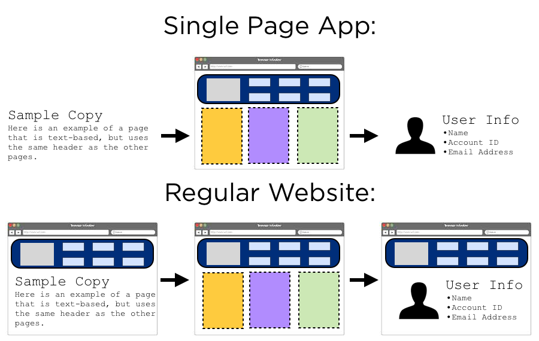
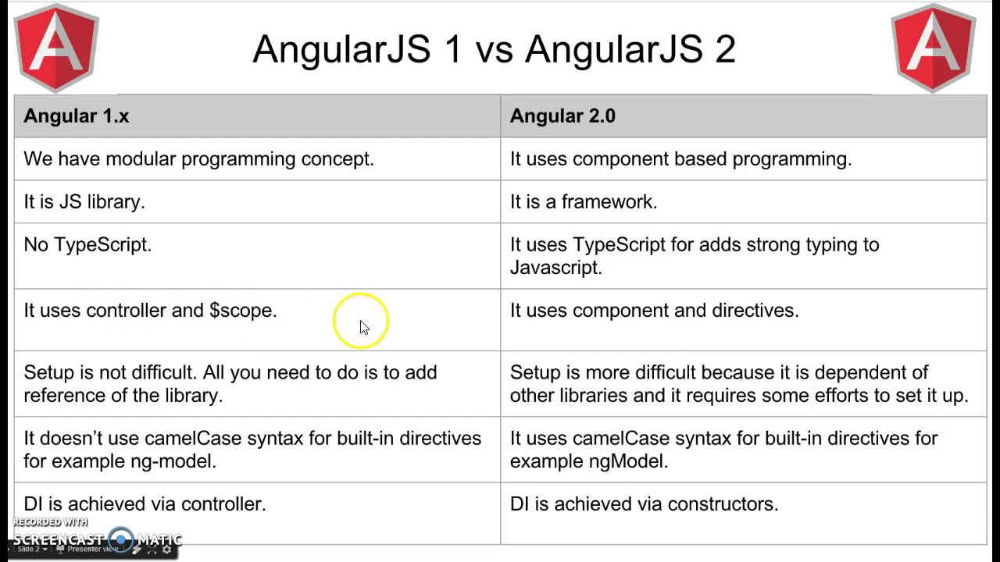
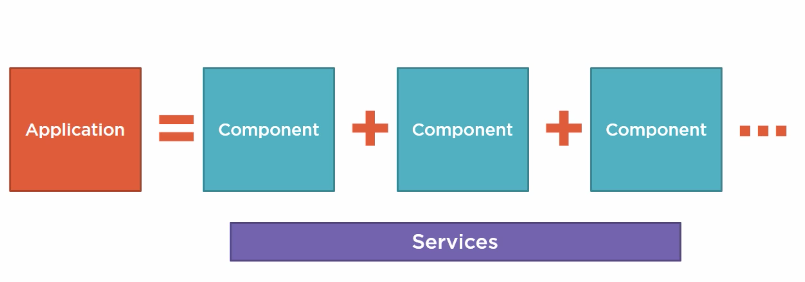
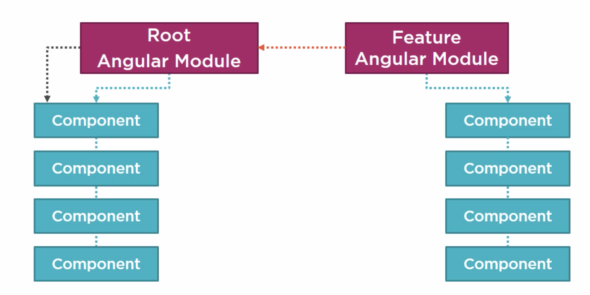
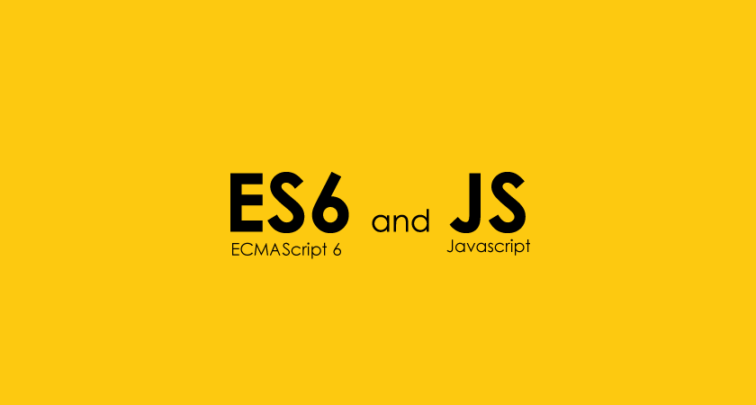
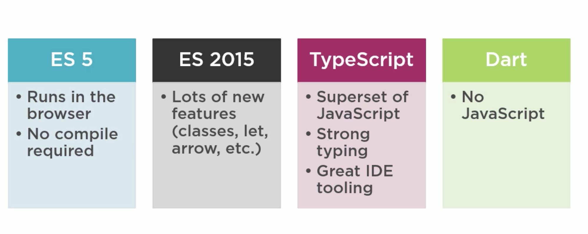
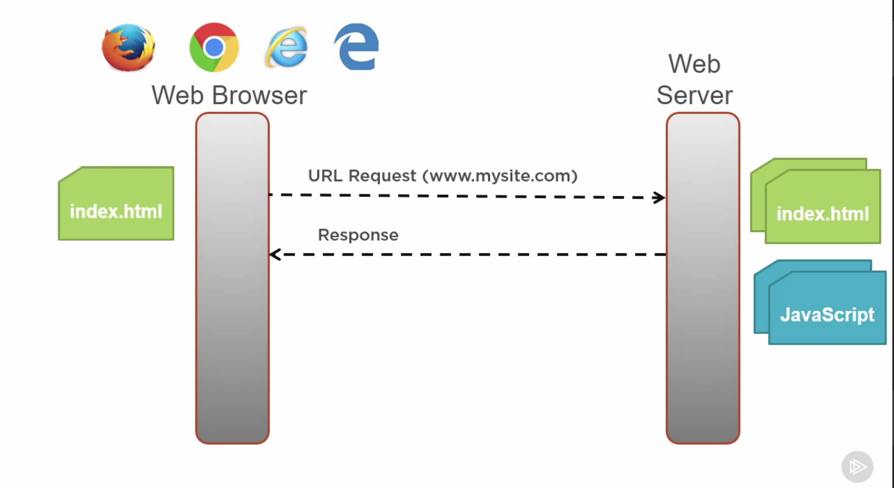

# Angular y el mundo de las SPAs

## Introducción al concepto de Single Page Applications

Esta clase tiene como objetivo introducirlos en el concepto de las SPAs y comenzar a ver a Angular como una tecnología para lograrlo.
Es interesante ver cómo esta relativamente "nueva"  forma de contruir aplicaciones web se diferencia de las maneras más "tradicionales", teniendo como objetivo entender qué diferencias residen entre una modalidad y otra. 

Hoy en día, este tipo de paginas ya tiene sus años, pero sigue siendo critico entender como funcion para poder lograr genera aplicaciones web performantes.

### ¿Cómo funcionaban las web applications tradicionalmente? RPAs

En el pasado, el flujo que exista en una aplicación web era algo así:

1) Se tenía un **Web Server** que provee "al mundo" el contenido de nuestro sitio (html, js, css, etc). Este se exponia a traves de una URL (llamemosla `www.mipagina.com`) a internet. 

2) Los usuarios, mediante un **Browser**, ingresaban la URL de la pagina (ibas al navegador e ingresabas `www.mipagina.com`) y se hacia una solicitud mediante HTTP. El Web Server obtenia esa solicitud, armaba el hhtml, js, css y lo devolvia al browser.

3) El browser recibe el contenido de la pagina (html, js y css) y tenia la logica para interpretarlo y mostrarlo en la pagina. Podia interpretar esos archivos (.html, .css, etc) y generar el contenido que se muestra

4) El usuario puede ver el contenido de la pagina. Este es estatico, ya que no cambia en ningun momento. Sin embargo, cuando se hacia click en un link (el cual enviaba a la url `www.mipagina.com/x` por ejemplo), este hace una nueva solicitud HTTP al Web Server, donde se obtiene un nuevo contenido (nuevos .html, .css, etc) y se vuelven a mostrar.

Entonces, si entro a:

* entro a `www.mipagina.com/x`: se obtiene un nuevo .html, .css, etc entero que pueda mostrar la pantalla completa
* entro a `www.mipagina.com/y`: se obtiene un nuevo .html, .css, etc entero que pueda mostrar la pantalla completa.
* ........ y asi para cada url


Este tipo de aplicaciones son conocidas como **Round-Trip Applications** (o **RTAs**).

Durante mucho tiempo, las aplicaciones web se fueron pensando como Round-Trip: el Browser hace el request inicial del documento HTML al servidor, las interacciones del Usuario hacían que el browser solicitara y recibiera un documento HTML completamente nuevo cada vez. 

En este tipo de aplicación, **el browser es solo una especie de renderer de HTML**, y toda la lógica de la aplicación va del lado del servidor. El browser realiza una serie de Requests HTTP sin estado que el Web Server maneja generando documentos **html** dinámicamente.

**Desventajas:**

Este modelo, si bien se sigue usando ampliamente hoy en día, tiene algunas **desventajas**:

1) El usuario debe esperar mientras el siguiente documento HTML se genera, requieren mayor infraestructura del lado del servidor para procesar todos los requests y manejar el estado de la aplicación, y requieren más ancho de banda, ya que cada documento HTML debe estar completamente autocontenido (debe tener todo lo necesario para mostrarse en pantalla).
2) A pesar de que el necesario en la pagina sea muy pequeño, como por ejemplo cambiar un text de un cuadradito arriba a la derecha en una pantalla, habia que solicitar toooda la pagina de vuelta, aunque solo hayan cambiando 3 lineas en el .html.
3) A su vez, la experiencia de usuario se degrada por factores como el efecto de refreshing (pestañeo) y el tiempo en ir a pedir los recursos al servidor.
4) Hacer interacciones en pantalla es mucho mas dificil, como animaciones, etc.

### ¿Cómo funcionan las SPAs? 

Una **SPA** es una *Single Page Application*. Como su nombre indica, es una aplicacion que consta de una sola pagina, que se solicita una vez, y se va actualizando de manera que sea necesario mientras se usa la aplicación.

En la peticion inicial (entro por el browser a `www.mipagina.com`), el webserver retorna un HTML inicial, el cual contiene el esqueleto de nuestra aplicación. Dentro de este se ingresa la información inicial de nuestra pagina.

Cada vez que se haga una interacción con algun elemento, por ejemplo apretar un link, **no** se ira a buscar una nueva pagina html entera. Lo que se hace es hacer una request HTTP al Web Server que retorne **solo** la info que necesitamos para hacer nuestros cambios. Esta información necesaria puede ser desde una linea de texto que necesitamos cambiar, hasta pequeñas porciones de html. Una vez obtenida esta información, se actualiza nuestro documento html inicial.

Las solicitudes mediante HTTP para obtener la información que cambió se hace mediante **AJAX**. Ajax (Asynchronous Javascript And Xml) es una tecnologia que permite hacer solicitudes HTTP desde el lado del cliente (el browser).

**El documento HTML inicial nunca se recarga**, y el usuario puede seguir intercalando con el html existente mientras las requests ajax terminan de ejecutarse asincrónicamente.



Particularmente veremos un framework que está 100% orientado a la construcción de SPAs: **Angular**.

El mismo logra logra sus mejores resultados cuando la aplicación a desarrollar se acerca al modelo de **Single-Page**. No quiere decir que no se pueda usar para Round-trip, pero hay otras herramientas, como **jQuery**, que lo hacen mejor.

### Características de las SPAs 

1) Como ya dijimos, este tipo de Web Apps es conocida porque tienen la posibilidad de redibujar la UI sin tener que realizar una nueva petición (**Round-Trip**) al servidor. 

2) Mejoran la UX por el hecho de que los usuarios tienen una experiencia ininterrumpida, sin que la página se refresque, y sin agregar complejidad. 

3) Son ideales para el mundo tanto web y mobile: no se agrega complejidad desde el lado del servidor para poder servir a diferentes dispositivos o plataformas. la lógica de lograr que nuestras web apps sean "responsive" siempre va desde el lado del cliente (browser), no se cargan nuevas páginas todo el tiempo.

4) Estan 100% alineadas al concepto de las APIs REST, debido a que estas simplemente exponen puntos para transaccionar y/o recibir o devolver datos, de una forma totalmente separada de la forma en que se van a mostrar.

6) El hecho de tener toda esta logica del lado del cliente (que se haga en el browser) permite que usar Javascript para hacer animaciones, mejorar la pagina, interacciones usuario-pagina, sean mucho mas faciles de hacer.

7) Optimiza el uso de internet, ya que se necesita muchas menos solicitudes y generalmente cada solicitud es mucho menos pesada (lleva mucho menos información)

## ¿Qué es Angular?


### Lectura Previa: ¿Por qué Angular?

https://medium.com/angular-japan-user-group/why-developers-and-companies-choose-angular-4c9ba6098e1c

### Introducción

* Framework de JavaScript 
* Orientado a construir Client-Side Apps  
* Basado en HTML, CSS y JavaScript (Typescript)

La meta de angular es traer las herramientas y capacidades que han estado disponibles para el desarrollo de back-end al cliente web, facilitando el desarrollo, test y mantenimiento de aplicaciones web complejas y ricas en contenido.

Angular funciona permitiéndonos extender HTML, expresando funcionalidad a través de elementos, atributos, clases y comentarios. 
Busca ser un framework que nos brinde soluciones a **todos** los problemas que se nos presentan a la hora de hacer paginas web, en comparación con otros frameworks. 

**Angular quiere resolver el problema de la complejidad de manejar el DOM, la lógica de una aplicación y los datos manualmente por separado**.

### ¿Por qué Angular?

* Angular nos brinda soluciones a todos los problemas que nos podemos encontrar haciendo paginas webs (manejo de estilos, componentizacion, llamadas AJAX, routing, y un largo etc). Todas estas soluciones se encuentran en un solo framework, haciendo que todos los proyectos sean bastante standard. 
* Angular promueve las buenas practicas de programación. Su manera de componentizar permite encapsular comportamiento de una excelente manera, facilitando el reuso de nuestro codigo.
* Su orientación a SPA permite que sea excelente para interactuar con APIs REST. Brinda varias herramientas para que esto sea simple.
* Ofrece *two-way data binding*, lo cual hace que manejar la información de nuestro sistema sea muy simple, actualizando toda la información a traves de nuestra aplicación en tiempo real.
* Soporte para aplicaciones altamente performante. Con el correr del tiempo, las versiones de angular fueron mejorando la performance ampliamente.
* Excelente *tooling* y soporte de la comunidad, lo cual facilita generar nuevos componentes, integraciones con IDEs, soluciones conocidas, etc.

### "Angular 1" vs Angular 2...7 (Menos el 3)

#### Un poco de historia

**AngularJS (Angular 1)**

A pesar de que vinieron frameworks anteriores a Angular, fue el primero que aparecio y brindo una solución compelta y usable a escala para hacer SPAs. Brindaba varias ventajas:

* Primer uso del *two-way data binding*
* Inyeccion de dependencias
* Utilizar las tecnologias que ya conocemos para utilizarlo (html, css, js)
* Estructura de una aplicacion de manera modular.

**Angular (del 2 al 7, a excepcion del 3)**

Con el correr del tiempo, las desventajas de AngularJS (Angular 1) empezaron a ser cada vez mas evidentes, sobretodo en aplicaciones grandes. Esto genero que surgan nuevos frameworks que explotaron. Muchos pueden haber escuchando sobre React o sobre Vue, dos proyectos que explotaron y son ampliamente utilizados en la industria.

En el 2014, se anuncio Angular 2, la nueva versión de Angular. Esta nueva versión cambio tanta cosa, llegando al nivel de no ser compatible en absoluto. Pasar de la versión anterior a la nueva rellevaria escribir toda la aplicación devuelta. 

Este cambio fue tan grande que se considera que se "re-arranco" Angular, haciendo referencia a Angular 1 como **AngularJS** y las nuevas versiones como **Angular**. Las nuevas versiones despues de Angular 2, fueron cambios incrementales, los cuales trajeron mejoras y nuevas features sobre estos cambios. 

Esta versión provee una serie de ventajas interesantes respecto a la versión anterior:

1) Es más rápido. Está más optimizado y **corre de 3-5 veces más rápido** que Angular 1.

2) Es más moderno, y toma en cuenta **features modernas de  JavaScript** que no estaban en otros frameworks de JavaScript (clases, modelos y decorators).

3) Mejora la productividad de forma sencilla:  **define patrones y building blocks** para la construcción de web apps.

4) Hace que implementar buenas practicas de programación sea extremedamente simple, como inyección de dependencias, etc. 

5) Usa **Typescript**, lo cual brinda varias ventajas, como veremos mas adelante.

También podemos realizar una comparativa a más detallada:



La versión del framework que usaremos es **Angular 7**, la ultiam versión liberada De aquí en adelante, siempre que hablemos de *Angular*, nos estaremos refiriendo a *Angular 7*.

## Arquitectura de una aplicación Angular



**Angular** es un framework open source que permite construir aplicaciones con html, css y Typescript. El core de Angular esta escrito en Typescript y brinda las funcionalidades principales para hacer una web minima. Angular como framework, tambien brinda varios paquetes extra, que brindan soluciones a problemas especificos. Un ejemplo de esto (que veremos mas adelante) es hacer llamadas mediante HTTP. Debemos importar un paquete que hace esto.

Existen 3 grandes conceptos que necesitamos tener claros para entender la arquitectura de Angular. Estos son los **Modulos**, **Componentes** y los **Servicios**.

En **Angular**, una aplicación **se define a partir de un conjunto de modulos, componentes y servicios**.

### Pero… ¿Qué es un componente en Angular?


Un componente es una una unidad modularizada que define la vista y la lógica para controlar una porción de una pantalla en Angular. Cada componente se compone de:

- Un **template (que es el HTML para la UI, también llamado la View)**. Sin los datos, por eso un template. Los datos serán inyectados de forma dinámico.

- Una **clase que es el código asociado a la View**, teniendo properties/datos que están disponibles para el uso de las Views, y métodos que son lógica o acciones para dichas views. Por ejemplo: responder a un click de un botón, o a un evento.

- **Metadata**, la cual provee información adicional del componente a Angular. Es lo que identifica a la clase  asociada al componente.

### ¿Y cómo hacemos que todos estos componentes se integren en una app en Angular? - Modules



Esto lo logramos a partir de lo que se llaman, **Angular Modules**. Estos nos permiten organizar nuestros componentes en funcionalidad cohesiva. Cada app angular tiene por lo menos un Angular Module, llamado el **Root Angular Module**.

Por convención, al Root Module le llamaremos **AppModule** en nuestra Angular app.

Una app puede tener un número de modulos adicionales, incluyendo **‘Feature Angular Modules’**, que los usamos para lograr una funcionalidad en especial. Consolidan un conjunto de componentes para una feature particular de una aplicación.

Los módulos de Angular, sin importar si son root o feature, son clases anotadas con el **decorator `@NgModule`**

#### Decorators

Son simplemente funciones que van a modificar nuestras clases de JavaScript. Angular define un montón de decoradores que agregan metada a las clases que vayamos definiendo, de manera que podamos agregarle funcionalidad extra a nuestras clases.

### Que son los services?

Los servicios son clases que tienen una unica responsabilidad a llevar a cabo. Esta responsabilidad no esta asociada a una pantalla, porcion de pantalla, url, ni nada en particular. Es simplemente una tarea que debemos llevar a cabo en nuestro sistema.

Un servicio puede tener la responsabilidad de mostrar logs de un sistema, hacer llamadas de networking para obtener informacion, entre muchas otras. 

Los servicios son simplemente clases de Javascript. Para poder ser utilizados, deben ser inyectados utilizando el sistema de inyeccion de dependencias. 

## Eligiendo un lenguaje para nuestras apps en Angular



### ECMAScript como una especificación de JS

JavaScript como lenguaje de programación, posee una especificación que define todas las reglas que este debe cumplir. Todas las versiones que vayan saliendo siempre de JavaScript, deben respetar dicha especificación/estándar, cuyo nombre es **ECMAScript** o de la forma usual en que se lo abrevia **(ES)**.

Las diferentes versiones que van saliendo, se van versionando con un número, y evidentemente cada una tiene diferente soporte en los browsers. Por ejemplo: ES3 es soportado por los browsers viejos, ES5 es actualmente la especificación que soportan todos los browsers nuevos.


Cuando queremos construir una Angular App, tenemos varias opciones de lenguajes que se adecuan con la especificación de JavaScript, y la idea aquí es ver cuál de ellas pueda resultarnos más útil.

### La necesidad de usar Transpilers


Una de las últimas y que tiene más soporte en Angular es **ES2015** (que antes se llamaba **ES6** y que fue aprobada hace 2-3 años apróximadamente). Esto tiene como consecuencia que la mayora de los browsers todavía no tienen soporte completo para la misma. Ver: http://kangax.github.io/compat-table/es6/

Es por esto que si usamos un lenguaje basado en ES2015, **este debe ser debe ser transpilado (transpiled), a ES2015**. Eso significa que todo el código que hagamos en ES6/ES2015 debe ser compilado por una herramienta que lo que haga es convertir toda nuestra sintaxis en ES2015 a la sintaxis ES5 **antes de que el browser lo ejecute**.

Aquí ganamos nosotros como desarrolladores, ya que podemos usar todas las features de ES2015, sin tener que abstenernos a lo que los navegadores soportan, obviamente siempre que usemos un transpilador.

### ¿Qué lenguaje usaremos?: TypeScript


Como Angular es una librería de JavaScript, podemos usar uno de los tantos lenguajes que compilan a JavaScript, para construir nuestras apps de Angular 2. Se puede usar:

* ES5
* ES2015 (también llamado ES6, transpilando el codigo a ES5 con Babel)
* TypeScript (y compilarlo a Javascript)



Particularmente, eligiremos **TypeScript**. Este este es un superset de JavaScript y debe ser transpilado. Uno de los beneficios más importantes de TypeScript (o simplemente TS), es que es fuertemente tipado, significando que todo tiene un tipo de datos asociado (una variable, una función, un argumento, etc). 

### Características de TypeScript

1) Se tienen una enormidad de ventajas a nivel de desarrollo (los IDEs pueden verificar la sintaxis, ofrecer documentación inline, code navigation, etc).

2) TypeScript es usado mismo por el equipo de Angular para desarrollar Angular. Y la documentación de Angular tiene todos los ejemplos usando TypeScript. Esto nos brinda facilidad de acceder a las herramientas que nos brinda Angular.

3) Es un lenguaje Open Source (Mantenido activamente por Microsoft).

4) Compila a JavaScript (viejo y conocido), a través de transpilación.

5) ¿Cómo hace TS para determinar los tipos apropiados cuando usamos librerías de JavaScript que no son fuertemente tipadas? A partir de usar TypeScript definition files (*.d.ts)

6) Tiene una EXCELENTE integración con Visual Studio Code, lo cual hace que la experiencia de desarrollo sea excelente.

7) TypeScript implementa la especificación de ES2015, y permite construir "clases" mas similares a los conceptos que ya tenemos. Se permite definir interfaces para los objetos, etc.


Este último punto para nosotros es muy interesante por el hecho de que **tenemos un background** (desde Programación 1), en **lenguajes orientados a objetos** (C++, Java, c#, etc). Usar TypeScript va a ser más natural para todos nosotros.

### Ejercicio: PlayGround de TypeScript

Entrar al siguiente [link](https://www.typescriptlang.org/play/) y comenzar a jugar con TypeScript como lenguaje.

## Tutorial: Armando nuestro ambiente

### 1) Instalando NPM (y Node)


A su vez, para armar nuestro ambiente también precisaremos instalar NPM. **NPM** o (*Node Package Manager*) es una **Command Line Utility** que nos permite interactuar, de una forma muy simple, con un conjunto enorme de proyectos *open-source*. Ha ganado muchísima popularidad al punto en que se ha convertido en EL package-manager para JavaScript. Con él, podemos instalar librerías, paquetes, aplicaciones, en conjunto con las dependencias de cada uno. Tambien nos permite el manejo de los proyectos realizados con Javascript (como es el caso de los de angular).

Lo bajaremos desde aquí: www.npmjs.com. Donde también nos pedirá instalar Node si es que no lo tenemos instalado ya.

#### ¿Por qué lo usaremos en nuestras Apps de Angular? 

1) Lo vamos a usar para instalar todas las librerías de Angular, es decir las dependencias.

2) También para ejecutar los transpiladores de nuestro código. NPM nos permitirá correr el compilador que convierta todos nuestros **.ts** en **.js**, de una forma muy simple, para que el navegador los pueda reconocer correctamente.

3) Funciona también como **WebServer**, que "servirá" nuestras Angular SPAs, en un web server liviando que levanta. Esto es mucho más cercano a un escenario real y evita problemas que suelen existir cuando accedemos directamente a los archivos a partir de su path en disco (`file://miarchivo.html`)

### 2) Construyendo nuestro ambiente de desarrollo

1. Crear una carpeta que contendrá nuestra aplicación.
2. Agregar los archivos de configuración y definición de paquetes.
3. Instalar dichos paquetes (usando npm).
4. Crear el modulo root de nuestra app angular (recordemos que toda app en Angular precisa de uno!).
5. Creamos el main.ts, que carga dicho modulo angular.
6. Creamos la página web host, (normalmente llamada index.html).

Estos pasos los podemos hacer manuales cómo se dice en htttp://www.angular.io o podemos dejar que se encarge el cli de angular (lo que haremos nosotros).

### Iniciando con ANGULAR

1. **Configurar el entorno de desarrollo** - Instalamos Angular CLI ```npm install -g @angular/cli``` (este comando instala el cli de angular de manera global y solo debemos ejecutarlo cuando no se encuentra el CLI en nuestra pc)
2. **Creamos nuestro proyecto** -  ```ng new NombreDelProyecto``` (si no se coloca un nombre se crea en el proyecto actual)
3. **Ejecutamos nuestro proyecto** - ```ng serve --open``` (--open habre una ventana en el navegador en ```http://localhost:4200/```)

### 3) ¿Qué sucede al levantar nuestra app?

Para probar nuestra app en el ambiente local, usamos el comando ```ng serve```. Esto lo que hace es levantar un Web Server para que nuestro navegador pueda consumir los archivos desde ahí. Es simplemente un ambiente local que funciona similarmente a un ambiente real.

Otros comandos interesantes (y necesarios) que tiene el cliente de angular son:

| Comando        | Descripcion           | 
| ------------- |:-------------:| 
| `ng add`      | Para agregar una libreria externa | 
| `ng build`     | Para compilar nuestro proyecto, listo para producción. Crea un archivo unico donde esta nuestro codigo. | 
| `ng lint` | Sirve para correr el linter en el proyecto |  
| `ng test` | Sirve para correr todos los tests |  

Cuando hacemos `ng serve`, se ejecutan varios pasos, los cuales se resumen a los siguientes:

* Primero, se ejecuta el compilador de Typescript, llamado **tsc**. Este agarra todos nuestros archivos .ts y los transforma en archivos .js. Tambien crea archivos .js.map que se utilizan en el browser. 
* Se crea un servidor local en un puerto especifico. Este toma nuestra aplicacion, y la hace accesible en el puerto por defecto. Aqui es que se ejecuta nuestro archivo `main`.
* Se corre el `watch`. Esta es una utilidad, que lo que hace es que cada vez que nosotros modificamos alguno de nuestro archivos, se hace una recompilación de nuestros archivos .ts y se levanta de nuevo el servidor. Esto nos evitar tener que ir a la consola, apagar el servidor, y levantarlo de vuelta. Podemos ir trabajando y viendo nuestros cambios en tiempo real.

Ejemplo:
- 1:  Cambio el Componente de APP


- 2:  Guardo y veo como el watcher se activa. Instantáneamente mis cambios en la vista se reflejan en el navegador


### 4) El punto de entrada de nuestra aplicación: index.html

Este es el documento que es llevado desde el Web Server hasta el navegador, aquí comienza a ejecutarse toda nuestra aplicación en Angular.

El proceso es similar a cómo describimos al principio:

Se realiza una request del navegador al web Server:


Y este le contesta:



#### ¿Qué contiene?

```html
<!doctype html>
<html lang="en">
<head>
  <meta charset="utf-8">
  <title>MyApp</title>
  <base href="/">

  <meta name="viewport" content="width=device-width, initial-scale=1">
  <link rel="icon" type="image/x-icon" href="favicon.ico">
</head>
<body>
  <app-root></app-root>
</body>
</html>
```
- Lo unico que interesante que destacar <app-root></app-root> que hace referencia a nuestro componente principal app.component.
- Casi nunca sera necesario editarlo, el CLI se encargara de añadir los archivos js y css al momento del building.

#### ¿Y nuestro main.ts?

```js
import { enableProdMode } from '@angular/core';
import { platformBrowserDynamic } from '@angular/platform-browser-dynamic';

import { AppModule } from './app/app.module';
import { environment } from './environments/environment';

if (environment.production) {
  enableProdMode();
}

platformBrowserDynamic().bootstrapModule(AppModule)
  .catch(err => console.error(err));
```
Es el punto de entrada de nuestra aplicacion. Compila la aplicación con el compilador JIT y arranca el módulo raíz de la aplicación (AppModule) para ejecutarse en el navegador. También puede se puede usar el compilador AOT sin cambiar ningún código agregando el indicador - aot a los comandos ng build y ng serve.
