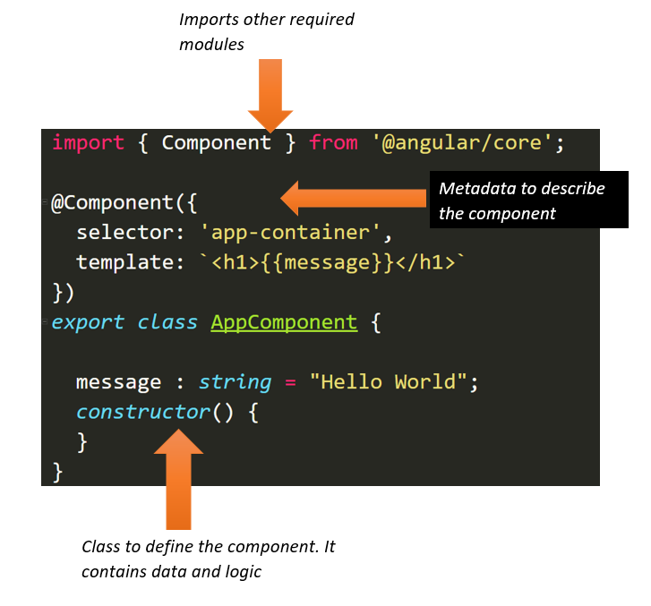
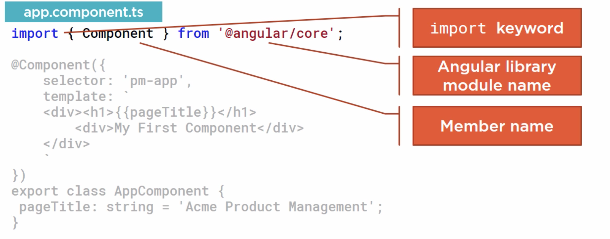
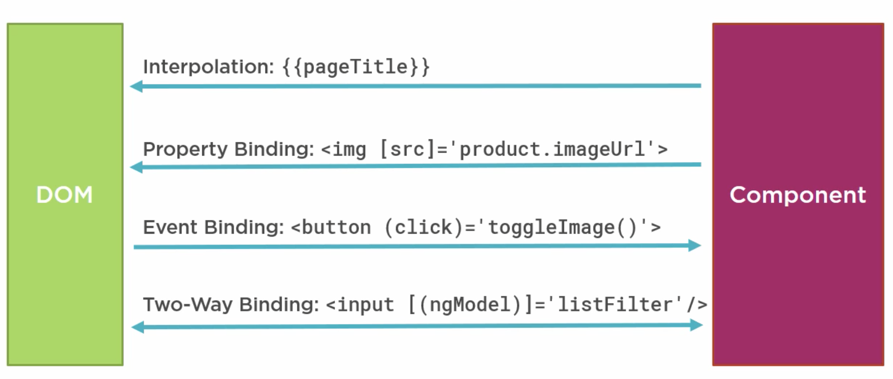
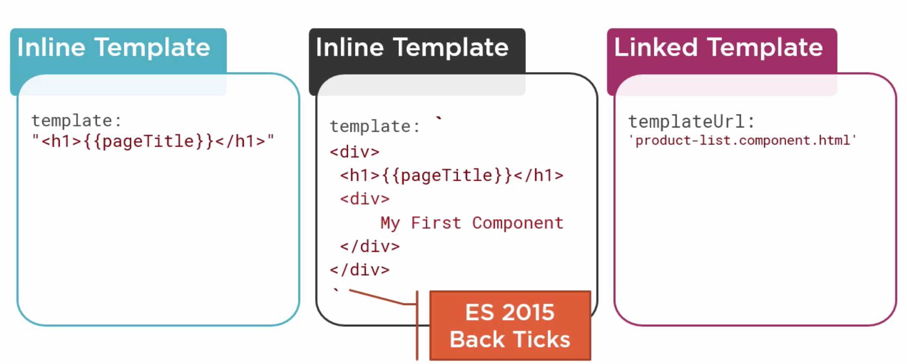
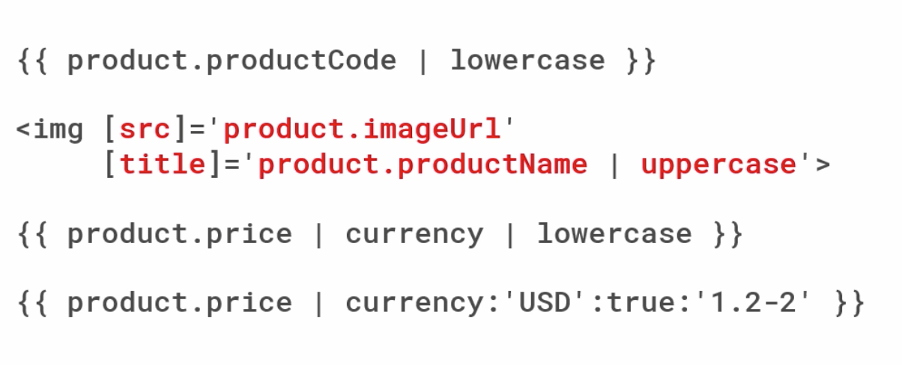

# Componentes, Templates, Bootstrapping, Directivas, Data Binding y Pipes

## Repasamos el concepto de Componente

### Fundamentos de los componentes

Cada componente la idea es que funcione armoniosamente y en conjunto con el resto para proveer una experiencia de usuario única. Como dijimos, estos son modulares, resuelven un problema concreto y colaboran entre sí para lograr ir armando la interfaz de usuario como un puzzle donde cada pieza tiene sus diferentes responsabilidades.

Por ejemplo, una excelente forma de pensar los componentes es a través de la siguiente imagen:


A su vez, es interesante recordar cómo se comporta internamente cada componente. Como habíamos dicho, los componentes se componen de tres cosas:

1) **Template:** El **template** del componente, el cual define la estructura (HTML o la vista) del mismo. Se crea con html y define lo que se renderizará en a página. A su vez incluye *bindings* y *directivas* para darle comportamiento a nuestra vista y hacerla dinámica. Estos dos conceptos los veremos más adelante en la clase.

2) **Clase:** A su vez la view tiene un código asociado, el cual llamamos la **clase** de un componente. Esta representa el código asociado a la vista (creada con TypeScript). Esta posee lo siguiente:

* *Datos*: Tambien llamados *properties*, a las cuales la vista puede acceder y mostrar. Por ejemplo, nuestra clase puede tener un atributo nombre, y desde la vista podemos acceder y mostrar el nombre en el html. 
* *Lógica/funciones:* Sirven para ejecutar el comportamiento de nuestro componente. Por ejemplo: la lógica para mostrar o esconder una imagen, la lógica para traer datos desde una Api, validaciones de datos, etc.
* *Metodos de ciclo de vida:* Permiten ejecutar codigo en determinadas instancias de la "vida" de un componente: cuando se crea, cuando se destruye, etc. Los veremos en detalle mas adelante.

3) **Metadata:** Finalmente, el componente también tiene **metadata**, que es información adicional para Angular, siendo esta definida con un *decorator* (los que arrancan con **@**, como en Java, que ya lo conocemos). Un decorador es una función que agrega metadata/funcionalidad a una clase, sus miembros o los argumentos de sus métodos.


### Ejemplo de una clase:

Aca veremos un ejemplo de un component, la sintaxis puede ser similar a la siguiente:

```typescript
export class NombreComponent {
  property1: tipo = valor,
  property2: tipo2 = valor2,
  property3: tipo2 = valor3

  ...
  Resto del código
  ...
}
```

Esta clase tiene 3 propiedades, los cuales son los `datos` de nuestro componente. Estos son accesibles desde el template. 

Asi como esta en este momento, todavia no se puede considerar un "component" de Angular, si no que es simplemente una clase de Javascript. Por eso, necesitamos utilizar el decorador ```Component```, el cual lo debemos importar desde ```@angular/core```:

```typescript
import { Component } from '@angular/core';

@Component({
  selector: 'nombre-component',
  template: `<h1>Hello {{property1}}</h1>`
})
export class NombreComponent {

  property1: tipo = valor,
  property2: tipo2 = valor2,
  property3: tipo2 = valor3

  ...
  Resto del código
  ...
}
```

Aquí estamos primero importando el decorator `Component` de Angular. El import funciona de manera "similar" a el `using` de .Net Core. Luego usamos el decorador arriba de la clase poniendolo como `@Component`. Este recibe varios parametros, en este caso selector (el nombre con el cual vamos a poder hacer referencia al componente) y template (como ya explicamos, el .html que muestra los datos de nuestro componente). El template esta mostrando en un `h1` el valor `property1`, que es uno de nuestros datos.

También podemos definir metodos dentro del componente. Por ejemplo, podemos crear un constructor para nuestro componente:

```typescript
import { Component } from '@angular/core';

@Component({
  selector: 'nombre-component',
  template: `<h1>Hello {{property1}}</h1>`
})
export class NombreComponent {

  property1: string;
  property2: number;

  constructor(property1: string, property2: number) {
    this.property1 = property1
    this.property2 = property2;
  }

  ...
  Resto del código
  ...
}
```

Algunos otros conceptos a tener en cuenta:

- Recordemos que por convención, el componente fundamental de una app de angular se llama `AppComponent` (el root component).
- La palabra reservada “export” simplemente hace que el componente se exporte y pueda ser visto por otros componentes de nuestra app. Todo lo que se *exporte* de un archivo se puede hacer *import* en otro archivo.
- La sintaxis de definición del archivo es ```nombre.component.ts```.
- El valor por defecto en las properties de nuestros componentes es opcional.
- Los métodos vienen luego de las properties, en `lowerCamelCase`.

### El Template y la Metadata de un componente

Sin embargo, como ya sabemos, las clases de los componentes no son lo único necesario que precisamos para armar nuestra app en angular, precisamos darle el HTML, la vista. Todo eso y más lo definimos a través del **metadata** del componente.

Una clase como la que definimos anteriormente se convierte en un componente de Angular cuando le definimos la metadata de componente.

Angular precisa de esa metadata para saber como instanciar el componente, estructurar la view, y ver la interacción:

- Usamos un decorator, siendo el scope de tal decorator la feature que decora.	Siempre son prefijos con un ```@```.
- Angular tiene un conjunto predefinido de decoradores que podemos usar, y hasta podemos crearnos los nuestros propios.
- El decorator va siempre antes de la definición de la clase, como las DataAnnotations en .NET (no va `;`)
- Es una función y recibe un objeto que define varias de las propiedades.

En otras palabras, el decorator ```@Component``` indica que la clase subyacente es un Componente de Angular y recibe la metadata del mismo (en forma de un objeto JSON de configuración). Aquí van algunas de las opciones de configuración más útiles para ```@Component```:

1) **selector**: Es un selector de CSS que le dice a Angular que cree e inserte una instancia de este componente en donde encuentre  un tag  ```<nombre-component>``` en su HTML padre. Por ejemplo, si el HTML  de una app contiene contiene ```<nombre-component></nombre-component>```, entonces Angular inserta una instancia de la view asociada a ```NombreComponent``` entre esos dos tags.

2) **template**: Representa el código HTML asociado al componente y que debe ser mostrado cada vez que se use su selector. Es la UI para ese componente. Se usa cuando el html es muy chico y no vale la pena tener otro archivo para definirlo (no se recomienda usarlo)

3) **templateUrl**: Similar al anterior pero permite referenciar a un documento HTML en lugar de tener que escribirlo directamente en el código del componente. Puedo ponerlo en un archivo separado y tratarlo simplemente como un HTML. Se referencia con una ruta relativa en el filesystem (por ejemplo `./archivo.html` o `../carpeta/archivo.html`)

4) **providers**: es un array de objeto de los providers de los servicios que el componente requiere para operar. Estos se inyectan a partir de inyección de dependencias; es simplemente una forma de decirle a Angular que el constructor del componente requiere algunos servicios para funcionar.

**Ejemplo:**



## Importando o exportando módulos y componentes

Antes de usar una función o clase externa, tenemos que decirle al modulo de dónde lo puede sacar. Eso lo hacemos con el statement ```import```. Este statement es parte de ES2015 y es implementado en TypeScript, funcionando como el import de java o el using de c#.

En consecuencia, nos permite usar todos los miembros que hayan sido *exportados* por el módulo que estamos importando (sea una librería de terceros, nuestros propios ES modules o modelos propios de Angular).



Esto es necesario debido a que angular es modular. Este define una colección de módulos que engloban funcionalidad. Cuando precisemos algo de angular lo tomaremos de un angular module.


Para ver todos los módulos disponibles de angular:

www.npmjs.com/~angular 

Por ejemplo, en el código de nuestros componentes, decoramos los mismos con la función Component que viene dentro de angular core, para poder definir nuestra clase como nuestra component.

```typescript 
import { Component } from ‘@angular/core’
```

Si queremos poner importar más de una clase desde dicho módulo, simplemente debemos separarlos por coma dentro de las llaves. Por ejemplo:

```typescript
import { a, b, c, d } from '../modulo'
```

## Bootstrapping o proceso de inicio de nuestra aplicación

¿Cómo le decimos a Angular que debe cargar nuestro componente principal? Le decimos a Angular que cargue nuestro AppComponent a través de un proceso que se llama ***Bootstrapping***, siendo el index.html quien  hostea nuestra app.

**Bootstrapping** es el proceso de iniciar y configurar nuestra aplicación. Por suerte, Angular se encarga casi completamente de este proceso.

Este proceso de lleva a cabo en el archivo `main.ts`, que es creado automaticamente:

```typescript
import { enableProdMode } from '@angular/core';
import { platformBrowserDynamic } from '@angular/platform-browser-dynamic';

import { AppModule } from './app/app.module';
import { environment } from './environments/environment';

if (environment.production) {
  enableProdMode();
}

platformBrowserDynamic().bootstrapModule(AppModule)
  .catch(err => console.error(err));
```

Podemos basarnos en varios mecanismos para levantar nuestros módulos. Particularmente, utilizaremos ```System.js```, para hacer que el componente principal (el root component) de nuestra app se cargue. Para leer más sobre System.js: https://github.com/systemjs/systemjs.

Y como Angular puede ser 'bootstrapped' en múltiples ambientes (como server-side), necesitamos importar un módulo específico para el ambiente en el que queremos 'bootstrappear' (crear) nuestra app (el navegador). Para levantar/bootstrappear en el navegador, necesitamos importar un módulo particular. 

En la clase se puede ver como se importa `import { platformBrowserDynamic } from '@angular/platform-browser-dynamic';`, la cual nos permite crear nuestra aplicación para el browser. Este módulo contiene, en simples plalabras, las features para que nuestra app precisa para corra en el navegador.

Todo esto es algo que no vamos a tener que interactuar mucho, ya que nos lo hace automaticamente Angular en principio y se define una vez. Sin embargo, es importante conocerlo por si se necesita modificar en algun momento.

Más sobre el proceso de Bootstrapping: https://toddmotto.com/bootstrap-angular-2-hello-world 

## Data Binding e Interpolación

Como mencionamos anteriormente, queremos que cada componente tenga asociada una cierta vista (HTML). 

Sin embargo, si se mostrara solo el HTML estatico, no estariamos teniendo ningun comportamiento ni nos serviria para nada. Queremos que los datos que se muestran en la misma sean dinámicos, y que vengan desde nuestro componente (la clase) pudiendo cambiarlos y modificarlos y que se vea reflejado en nuestra vista. 

No queremos hardcodear el HTML que representa los datos a mostrar. Por ejemplo:

No queremos:

```html
<div class='panel-heading'>
    Nombre de la página que puede cambiar
</div>
```

Queremos:

```html
<div class='panel-heading'>
    {{pageTitle}}
</div>
```

```typescript
export class MyComponent {
  pageTitle: string = "Nombre de la página que puede cambiar"

  constructor(pageTitle : string)
  {
    this.pageTitle = pageTitle;
  }
}
```

Lo que se ve en el código anterior es el concepto de **Data Binding**, es decir, "el enlace" existente entre una porción de UI y ciertos datos de una clase de un componente. En otras palabras, estamos diciendole a la UI que mire el valor de la property ```pageTitle``` de la clase. Si dicha property cambia, entonces el valor mostrado por la UI cambia.
 
De manera que cuando el HTML se renderiza, el HTML muestra el valor asociado al modelo pageTitle.

El Data Binding va de la mano del concepto de **interpolación**, la cual es la habilidad de poner datos dentro de un HTML (interpolar). Esto es lo que logramos con las llaves dobles ``` {{ ... }} ```.


La interpolación no es el único tipo de Data Binding, también hay otros:

- **Property Binding**: cuando el binding es hacia una property particular de algun elemento, como puede ser el valor de un `img`. Setea el valor de una property a un a expresíon en el template. Ver sintaxis en imagen de abajo.

- **Event Binding**: es binding hacia funciones o métodos que se ejecutan como consecuencia de eventos (por ejemplo: un click sobre un elemento. Cuando se hace un click a un elemento, se llama un metodo especifico).

- **Two-Way Binding**: Es un ida y vuelta entre el template y una property entre un component. Muestra el valor de la property en la vista, y si en la vista/template dicho valor cambia, la property también se ve reflejada (por eso es de *dos caminos*). Esto lo veremos con más detalle en el tutorial de más abajo.



## Directivas

A su vez, también podemos enriquecer nuestro HTML a partir de lo que se llaman **directivas**, pudiendo agregar **ifs** o **loops** (estilo for), sobre datos en nuestro HTML y generar contenido dinámicamente.

Una directiva es un elemento custom del HTML que usamos para extender o mejorar nuestro HTML. Cada vez que creamos un componente y queremos renderizar su template, lo hacemos a través de su *selector* asociado, el cual define la directiva del componente.

Pero a su vez angular también tiene algunas directivas built-in, sobre todo las *structural directives*. Por ejemplo: **ngIf** o **ngFor**.

## Tutorial: nuestro primer Component 

En este tutorial veremos la creación de un componente, agregarlo a nuestro módulo principal, trabajaremos con templates, data binding, interpolación y directivas.
** Para ello haremos un listado de tareas. **

### 1. Instalamos Bootstrap

Instalamos la librería Bootstrap (nos da estilos y nos permite lograr diseños responsive de forma simple). Esto es completamente opcional, pueden usar bootstrap en caso de querer usarlo, si no todo es completamente factible de hacer sin esta libreria. 

Mas info sobre bootstrap y angular en conjunto [aqui](https://codeburst.io/getting-started-with-angular-7-and-bootstrap-4-styling-6011b206080)

Para ello, parados sobre nuestro proyecto usamos npm para descargarla (recordemos que npm es como Nuget pero para librerías o módulos de JavaScript):

```
npm install bootstrap@3 --save
```

El `--save` al final del `npm install` es **MUY** importante. El `--save` del comando lo que hace es guardar la referencia a este módulo en el package.json. De esta manera, cuando alguien se clone nuestro proyecto, con hacer `npm install` se la instalaran todas las dependencias necesarias para correr el proyecto

*Detalle:* dependiendo de la version de npm utilizada, puede ser que el `--save` sea la opción por defecto.

Vemos como se impacta el package.json

```json
"dependencies": {
    "@angular/animations": "~7.2.0",
    "@angular/common": "~7.2.0",
    "@angular/compiler": "~7.2.0",
    "@angular/core": "~7.2.0",
    "@angular/forms": "~7.2.0",
    "@angular/platform-browser": "~7.2.0",
    "@angular/platform-browser-dynamic": "~7.2.0",
    "@angular/router": "~7.2.0",
    "bootstrap": "^4.3.1",
    "core-js": "^2.5.4",
    "rxjs": "~6.3.3",
    "tslib": "^1.9.0",
    "zone.js": "~0.8.26"
}
```

Y en el `angular.json` agregamos (en `projects/:NOMBRE DEL PROJECTO:/architect/styles`) para poder usarlo en nuestra aplicacion.

```json
"styles": [
  "node_modules/bootstrap/dist/css/bootstrap.min.css",
  "src/styles.css"
],
```

### 3. Creamos nuestro componente

Para eso lanzaremos el siguiente commando `ng generate component HomeworksList`.

Esto crea una carpeta llamada **homeworks-list**, con 4 archivos:

- **homeworks-list.component.spec.ts** (Archivo con pruebas) (Se puede tanto eleminar como mover a la carpeta e2e)
- **homeworks-list.component.ts** (Archivo con la clase del componente y la metadata)
- **homeworks-list.component.html** (Archivo que contiene la vista)
- **homeworks-list.component.css** (Archivo que contiene el css del componente)

Este commando nos agrega el componente automaticamnte al array declarations en `app.module.ts`.

```json
{
  declarations: [
    AppComponent,
    HomeworksListComponent,
    ...
  ],
....
```

### 3. Agregamos el html.
Agregamos en nuestro archivo de vista (```homeworks-list.component.html```) nuestro template basico.



Particularmente utilizaremos la propiedad ```templateUrl``` luego en nuestro componente:

```html
<div class='panel panel-primary'>
    <div class='panel-heading'>
        Homeworks List
    </div>

    <div class='panel-body'>
        <!-- Aca filtramos las tareas  -->
        <!-- Selector de filtro:  -->
        <div class='row'>
            <div class='col-md-2'>Filter by:</div>
            <div class='col-md-4'>
                <input type='text' />
            </div>
        </div>
        <!-- Muestra filtro:  -->
        <div class='row'>
            <div class='col-md-6'>
                <h3>Filtered by: </h3>
            </div>
        </div>

        <!-- Mensaje de error -->
        <div class='has-error'> </div>

        <!--Tabla de tareas -->
        <div class='table-responsive'>
            <table class='table'>
                <!--Cabezal de la tabla -->
                <thead>
                    <tr>
                        <th>Id</th>
                        <th>Description</th>
                        <th>DueDate</th>
                        <th>Score</th>
                        <th>
                            <button class='btn btn-primary'>
                               Show Exercises
                            </button>
                        </th>
                    </tr>
                </thead>
                <!--Cuerpo de la tabla-->
                <tbody>
                    <!-- Aca va todo el contenido de la tabla  -->
                </tbody>
            </table>
        </div>
    </div>
</div>
```
### 4. El código del componente

Modificamos el archivo ```homeworks-list.component.ts``` y le agregamos el siguiente código:
```typescript
import { Component, OnInit } from '@angular/core';

@Component({
  selector: 'app-homeworks-list',
  templateUrl: './homeworks-list.component.html',
  styleUrls: ['./homeworks-list.component.css']
})
export class HomeworksListComponent implements OnInit {
    pageTitle: string = "Homeworks List"
    
    constructor() { }

    ngOnInit() {
    }
}
```

### 5. Agregamos el componente nuevo a través de su selector.

Si vemos la definicion de nuestro component `homeworks-list`, vemos que se definio como selector: `selector: 'app-homeworks-list'`. Esto indica que debemos usar este nombre `app-homeworks-list` para mostrarlo. Es decir, si ponemos `<app-homeworks-list />` en el template de algun componente, nuestro componente se va a mostrar.

Lo que haremos aquí es usar el selector mencionado en el root component, es decir el AppComponent, para mostrarlo. 

De manera que en ```app.component.ts``` quedaría algo como:

```typescript
import { Component } from '@angular/core';

@Component({
  selector: 'app-root',
  templateUrl: './app.component.html',
  styleUrls: ['./app.component.css']
})
export class AppComponent {
    title: string = 'Homeworks Angular';
    name: string = "Federico Ojeda";
    email: string = "fedeojeda95@hotmail.com";

    address = {
        street: "Una direccion",
        city: "Una ciudad",
        number: "1234"
    }
}

```
Y nuestro `app.component.html`:

```html
<div style="text-align:center">
    <h1>Bienvenidos a {{title}}</h1>
    <h2>Curso de DA2 de {{name}}</h2>
    <p> <strong>Email:</strong> {{email}} </p>
    <p> <strong>Dirección:</strong> {{address.street}} {{address.number}} de la ciudad - {{address.city}} </p>
</div>
<app-homeworks-list></app-homeworks-list>
```

Sin embargo, con esto no basta, ya que para que un componente pueda usar a otro componente (a través de su `selector`), estos deben pertenecer al mismo módulo, o el módulo del componente que importa debe importar al módulo del otro componente.

En consecuencia, vamos a `app.module.ts`, y nos aseguramos que se encuentre el import:

```typescript
import { BrowserModule } from '@angular/platform-browser';
import { NgModule } from '@angular/core';
import { AppComponent } from './app.component';
import { HomeworksListComponent } from './homeworks-list/homeworks-list.component';

@NgModule({
  declarations: [
    AppComponent,
    HomeworksListComponent,
  ],
  imports: [
    BrowserModule,
  ],
  providers: [],
  bootstrap: [AppComponent]
})
export class AppModule { }
```

¿Como hace el componente para saber a dónde buscar el component? Cómo ya dijimos, ahora lo encuentra porque pertenecen al mismo modulo. El módulo que sea dueño de este component es examinado para encontrar todas las directivas que pertenecen al mismo.

Por aohra solo deberia mostrar el titulo y nada mas, lo cual cambiaremos a continuación.

### 5. Usando Data Binding para mostrar datos dinámicos

Tenemos una pequeña tabla que muestra cosas, pero todavía no tiene ningún tipo de interacción o datos adentro, por lo que comenzaremos a explorar más a fondo las features de angular que nos permiten manejar eventos y user input.

Ahora lo que queremos es hacer es poner contenido dinámico en nuestro componente. Para ello, repasemos el concepto de **Binding**. Este es el mecanismo que tiene Angular para coordinar los datos que existen en la clase de nuestro componente con su template, es decir en cómo se pasan los datos entre uno y otro.

La sintaxis del binding siempre se define en el template, a partir de lo que ya sabemos que se llama **interpolación**


La interpolación soporta mucho más que el mostrado properties simples, también permite realizar operaciones complejas o cálculos, o llamar métodos!

Hacer cambio en el  `homeworks-list.component.html` y poner:

```
 <div class='panel-heading'>
     {{pageTitle}}
 </div>
```

Veamos que pasa.

## Directivas de Angular

A continuación, explicaremos algunas de las directivas de Angular que nos seran de utilidad para definir nuestros componentes.

### 6. Utilizando *ngIf para elegir hacer algo o no

En el template, cambiamos ```<table clas="table">``` por lo siguiente:

```html
<table class='table' *ngIf='homeworks && homeworks.length'>
```

Que hace esto? `ngIf` debe ser una expresión que evalue a booleano. Si el valor de esta expresión es `true`, entonces se va a mostrar. Si es `false`, analogamente no se muestra. Es extremadamente util para situaciones donde queremos mostrar algo o no en funcion de si tenemos datos, o si debemos ocultarlos por alguna situación.

En este caso, la condición `homeworks && homeworks.length`, estamos fijandonos si la propiedad `homeworks` existe (o no es null) y si el largo es mayor a 0.

Esto todava no va a tener resultado hasta que en el paso siguiente agreguemos la property 'homeworks' al componente.

### 7. Utilizando *ngFor para iterar sobre elementos de forma dinamica

Antes de utilizar esta directiva, deberemos crear nuestros modelos. Para esto, creamos una carpeta `Models`. Aca añadiremos nuestras clases que representan nuestros modelos.

Por ultimo, agregaremos una property del tipo de uno de nuestros modelos a nuestro componente.

Crearemos la clase Exercise y Homeworks dentro de Models

**Clase Exercise en la carpeta Models:**

```typescript
export class Exercise {
    id: string;
    problem: string;
    score: number;

    constructor(id: string = "", problem: string = "", score: number = 0) {
        this.id = id;
        this.problem = problem;
        this.score = score;
    }
}
```

**Clase Homework en la carpeta Models:**

```typescript
import { Exercise } from './Exercise';

export class Homework {
    id: string;
    description: string;
    dueDate: Date;
    score: number;
    exercises: Array<Exercise>;

    constructor(id: string, description: string, score: number, dueDate: Date, exercises: Array<Exercise>){
        this.id = id;
        this.description = description;
        this.score = score;
        this.dueDate = dueDate;
        this.exercises = exercises;
    }
}
```

Podemos ver como estas clases definen los tipos de sus propiedades, aprovechando las capacidades de Typescript.

Modificamos nuestro componente `homeworks-list`:

```typescript
import { Component, OnInit } from '@angular/core';
import { Homework } from '../models/Homework';
import { Exercise } from '../models/Exercise';

@Component({
  selector: 'app-homeworks-list',
  templateUrl: './homeworks-list.component.html',
  styleUrls: ['./homeworks-list.component.css']
})
export class HomeworksListComponent implements OnInit {
    pageTitle: string = "Homeworks List";
    homeworks: Array<Homework> = [
        new Homework("1", "Una tarea", 0, new Date(), [new Exercise("1", "Un Problema", 0)]),
        new Homework("2", "Otra tarea", 0, new Date(), [])
    ];

    constructor() { }

    ngOnInit() {
    }
}

```
Y en el template cambiamos el `<tbody>` por lo siguiente:

```html
<tbody>
  <tr *ngFor='let homework of homeworks'>
      <td>{{homework.id}}</td>
      <td>{{homework.description  | uppercase}}</td>
      <td>{{homework.dueDate}}</td>
      <td>{{homework.score}}</td>
      <td>
          <div>
              <table>
                  <thead>
                      <tr>
                          <th>Problem</th>
                          <th>Score</th>
                      </tr>
                  </thead>
                  <tbody>
                      <tr *ngFor='let exercise of homework.exercises'>
                          <td>{{exercise.problem}}</td>
                          <td>{{exercise.score}}</td>
                      </tr>
                  </tbody>
              </table>
          </div>
      </td>
  </tr>
</tbody>
```

## 7. Agregando Two-Way Binding:

Si vemos el template de nuestro componente, podemos ver que tenemos un campo arriba para agregar un filtro en nuestros deberes en función de un texto. Queremos que si se escribe en ese campo, se filtren los homework por ese texto. También queremos que si desde el componente cambiamos el texto, esto se vea reflejado en la vista. Esto lo llamamos **two-way data binding**, lo cual veremos a continuación.

En nuestro HomeworksListComponent, agregamos la property listFilter:

```typescript
listFilter: string;
```

Esta property contendra el valor por el que queremos filtrar nuestros homeworks.

En el template asociado, reemplazamos los dos primeros divs de class "row" que aparecen:

```html
<div class='row'>
    <div class='col-md-2'>Filter by:</div>
    <div class='col-md-4'>
        <input type='text' [(ngModel)]='listFilter' />
    </div>
</div>
<div class='row' *ngIf='listFilter'>
    <div class='col-md-6'>
        <h3>Filtered by: {{listFilter}} </h3>
    </div>
</div>
```

En el cambio podemos ver lo siguiente: `[(ngModel)]`. Esta sintaxis es la que utiliza Angular para hacer el two-way data binding. Aqui, estamos diciendole al `input` que se bindee a la propiedad `listFilter`.

Si corremos (o estamos corriendo) nuestra aplicación en este momento, vemos que esto no anda. Porque? Nos dice que `ngModel` no existe.

```
Template parse errors:
Can't bind to 'ngModel' since it isn't a known property of 'input'.
```

Esto ocurre debido a que para poder trabajar con esta directiva, debemos importar el modulo de Angular llamado `Forms`, el cual la implementa.

Para ello vamos al `app.module.ts` y agregamos el import a FormsModule:

```typescript
import { BrowserModule } from '@angular/platform-browser';
import { FormsModule } from '@angular/forms';
import { NgModule } from '@angular/core';

import { AppComponent } from './app.component';
import { HomeworksListComponent } from './homeworks-list/homeworks-list.component';

@NgModule({
  declarations: [
    AppComponent,
    HomeworksListComponent
  ],
  imports: [
    BrowserModule,
    FormsModule
  ],
  providers: [],
  bootstrap: [AppComponent]
})
export class AppModule { }
```

Debemos primero hacer el import, y luego agregarlo en el array de `imports`

Mas adelante, veremos como agregarle el filtro al `ngFor`.

Esto que hicimos se llama **Two-Way Binding**.


Two-Way Binding es simplemente un mecanismo a partir del cual podemos establecer un enlace entre nuestros datos (properties), y una expresión en un template; de manera que cada vez que desde la UI se modifique dicho valor, el valor de la property cambia, y viceversa.

### 7. Usando Pipes en Angular

Cuando queremos transformar nuestros datos al momento de ser mostrados, angular nos provee una herramienta llamada Pipes. Estos permiten realizar una accion sobre un datos (o un conjunto de datos) para transformarlos a algo que nos sea mas util. Por lo general, se utilizan para aplicar ciertas logica sobre las propierties de nuestra clase antes de ser mostradas.

Angular ya provee varios Pipes dentro del framework para transformar distintos datos (date, number, decimal, json, etc). Estos nos ayudan a que los datos sean mas "user-friendly" y a mostrarlos de una mejor manera. 

Angular no solo te limita a estos, si no que también permite crear nuestro propios pipes para manejar nuestros datos. Un ejemplo de esto puede ser el filtrado de una lista de datos (como en nuestro caso). 

Los pipes en general se denotan con el caracter `|` (pipe), expresión.

La sintaxis para usar pipes es la siguiente:

{{ input | nombreDelPipe }}

Esto toma el valor de input, y lo usa como parametro del pipe de nombre `nombreDelPipe`.

Por ahora, nos quedaremos con pipes simples, como los de la imagen:



En el primer ejemplo: ` {{ product.productCode | lowercase }}`

Para ello, simplemente cambiamos:
```html
<td>{{homework.description | uppercase}}</td>
... // o
<td>{{homework.description | lowercase}}</td>
```

Como se pueden imaginar, lo que hace es tomar el valor de la izquierda y pasarlo a mayuscula (o minuscula)

## 8. Agregando Event Binding para los Exercises

Hasta ahora, vimos como mostrar información en pantalla, pero vimos muy poco de como interactuar con nuestra aplicación. Como hacemos para reaccionar cuando, por ejemplo, se hace click en un boton?

Para realizar esto, usaremos **Event Binding**. Lo que hara sera comunicarse desde la vista a la clase, notificandole de que ocurrio determinado evento. Esto es contrario a lo que vimos hasta ahora en por ejemplo, la interpolación, donde el componente se comunicaba con la vista para darle información.

Cada vez que ocurra un evento, se llamara a uno de los metodos que tenemos en nuestra clase del componente. Un evento puede ser, como ya fue mencionado un click, pero hay muchos mas, como por ejemplo, un hover (pasar el mouse por encima de algo), un copy & paste, un scroll, un tecleo, etc.

La información de eventos disponibles que podemos usar se encuentra bien documentada en:
https://developer.mozilla.org/en-US/docs/Web/Events

La idea es que nuestros componentes estén funcionando como "listeners" a las acciones del usuario, usando Event Binding, y pudiendo ejecutar cierta lógica particular.

La sintaxis es por ejemplo:

```html
<button (click)='hacerAlgoCuandoOcurreClick()'> </button>
```

- El nombre del evento va entre paréntesis.
- La lógica a ejecutar va entre comillas simples luego del `=`.

**Ejemplo:**

Lo que haremos ahora es la lógica del mostrado de Exercises con Event Binding, para ello:

En `homeworks-list.component.ts`, agregamos la siguiente property a la clase:

```typescript
showExercises: boolean = false;
```

A su vez agregamos la siguiente función:

```typescript
toggleExercises(): void {
    this.showExercises = !this.showExercises;
}
```

Quedando:
```typescript
import { Component, OnInit } from '@angular/core';
import { Homework } from '../models/Homework';
import { Exercise } from '../models/Exercise';

@Component({
  selector: 'app-homeworks-list',
  templateUrl: './homeworks-list.component.html',
  styleUrls: ['./homeworks-list.component.css']
})
export class HomeworksListComponent implements OnInit {
    pageTitle:string = "Homeworks List";
    listFilter:string = "";
    showExercises:boolean = false;
    homeworks:Array<Homework> = [
        new Homework("1", "Una tarea", 0, new Date(), [new Exercise("1", "Un Problema", 0)]),
        new Homework("2", "Otra tarea", 0, new Date(), [])
    ];

    constructor() { }

    ngOnInit() {
    }

    toggleExercises(): void {
        this.showExercises = !this.showExercises;
    }

}
```
Y en el template hacemos estos dos cambios:
1) En cada click al botón que tenemos en el header de la tabla, llamamos a la función ```toggleExercises()```:

```html
<button (click)='toggleExercises()' class='btn btn-primary'>
    {{showExercises ? 'Hide' : 'Show'}} Exercises
</button>
```

Aquí estamos haciendo event binding para el evento del click. Cada vez que se haga click en el boton, se llamara al metodo `toggleExercises`. Este lo unico que hace es dar vuelta la condición de si mostrar los ejercicios o no. 

2) En el mostrado de los Exercises, agregamos la condición de que solo se muestre si la property lo indica.

```html
<div *ngIf='showExercises'> // agregamos esta linea
    <table>
        <thead>
            <tr>
                <th>Problem</th>
                <th>Score</th>
            </tr>
        </thead>
        <tbody>
            <tr *ngFor='let exercise of homework.exercises'>
                <td>{{exercise.problem}}</td>
                <td>{{exercise.score}}</td>
            </tr>
        </tbody>
    </table>
</div>
```
